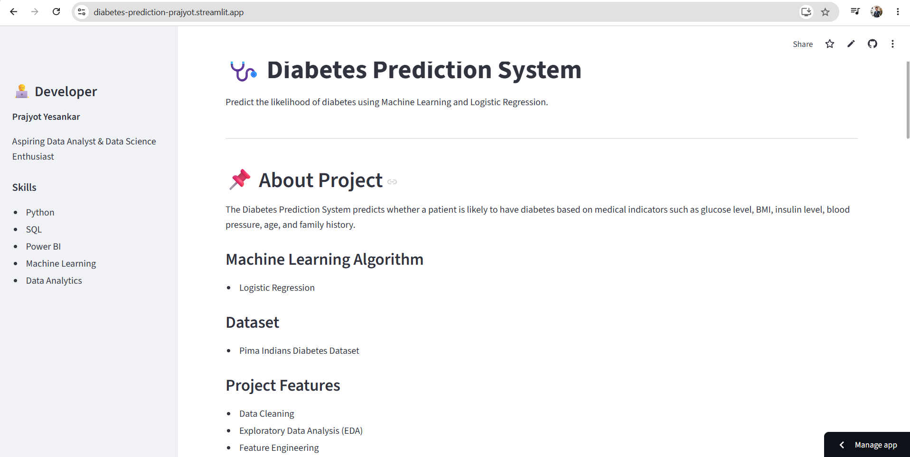
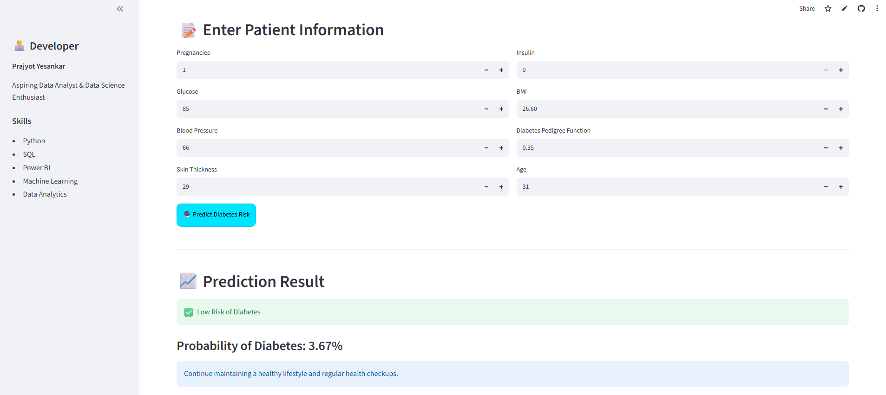
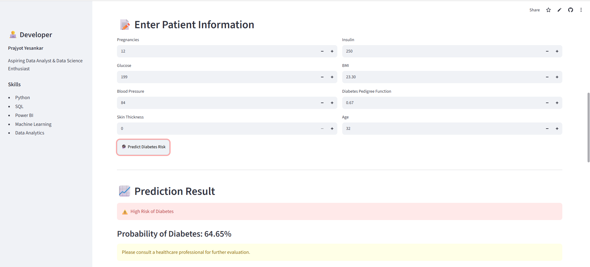

# 🩺 Diabetes Prediction Web App

A Machine Learning web application that predicts the likelihood of diabetes using Logistic Regression and Streamlit.

## 🚀 Live Demo

https://diabetes-prediction-prajyot.streamlit.app

---

## 📌 Project Overview

The Diabetes Prediction System predicts whether a patient is likely to have diabetes based on health indicators such as:

- Pregnancies
- Glucose
- Blood Pressure
- Skin Thickness
- Insulin
- BMI
- Diabetes Pedigree Function
- Age

The model is trained using the Pima Indians Diabetes Dataset and Logistic Regression algorithm.

---

## 📸 Application Preview

### Homepage



### Low Risk Prediction



### High Risk Prediction



---

## ✨ Project Highlights

- End-to-End Machine Learning Project
- Logistic Regression Classification Model
- Data Cleaning and Feature Scaling
- Exploratory Data Analysis (EDA)
- Interactive Streamlit Web Application
- Real-Time Diabetes Risk Prediction
- Deployed on Streamlit Cloud

---

## 🛠 Technologies Used

- Python
- Pandas
- NumPy
- Matplotlib
- Seaborn
- Scikit-learn
- Logistic Regression
- Streamlit
- Joblib

---

## 📊 Machine Learning Workflow

1. Data Collection
2. Data Cleaning
3. Exploratory Data Analysis (EDA)
4. Feature Scaling
5. Train-Test Split
6. Logistic Regression Model Training
7. Model Evaluation
8. Streamlit Web App Deployment

---

## 📈 Model Performance

- Algorithm: Logistic Regression
- Classification Problem: Diabetes Prediction
- Model Accuracy: 78%

---

## 📂 Project Structure

```text
Diabetes-Prediction-WebApp/
│
├── app.py
├── train_model.py
├── requirements.txt
├── README.md
│
├── data/
│   └── diabetes.csv
│
├── model/
│   ├── diabetes_model.pkl
│   └── scaler.pkl
│
├── images/
│   ├── homepage.png
│   ├── prediction_low_risk.png
│   └── prediction_high_risk.png
│
└── notebooks/
    └── diabetes_prediction.ipynb
```

---

## ▶️ Run Locally

Clone the repository:

```bash
git clone https://github.com/yesankarprajyot123/diabetes-prediction-webapp.git
```

Move to project folder:

```bash
cd diabetes-prediction-webapp
```

Install dependencies:

```bash
pip install -r requirements.txt
```

Run Streamlit:

```bash
streamlit run app.py
```

---

## 👨‍💻 Developer

### Prajyot Yesankar

B.Tech Computer Science & Design

Passionate about Data Analytics, Data Science, Machine Learning, Python, SQL, and Power BI. I enjoy building real-world projects that solve practical business and healthcare problems.

---

## 🔗 Connect With Me

- 💼 LinkedIn: https://www.linkedin.com/in/prajyot-yesankar-79215b258/
- 💻 GitHub: https://github.com/yesankarprajyot123
- 📧 Email: yesankarprajyot@gmail.com

---

⭐ If you found this project useful, feel free to give it a star on GitHub.

❤️ Developed by Prajyot Yesankar